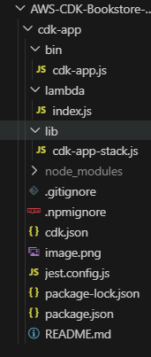

# CDK-Bookstore-API

## Description 
- CDK-Bookstore-API is a serverless application built using AWS Cloud Development Kit (CDK) to create a scalable and efficient bookstore API. This project aims to demonstrate how to leverage AWS services such as Lambda functions, API Gateway, and DynamoDB to develop a robust API for managing books. With CDK, infrastructure is defined as code, enabling easy deployment and management of AWS resources. The API supports CRUD operations for books, including creating, reading, updating, and deleting book records. Additionally, it includes a health check endpoint to ensure the availability and reliability of the API.  

## Features
- Create, Read, Update, and Delete (CRUD) operations for books
- Serverless deployment with AWS

## Installation 
### Prerequisites 
- Node.js
- AWS CLI 
- AWS CDK

## API Endpoints 
- GET /health: Health check endpoint
- GET /books: Retrieve all books
- GET /books/{id}: Retrieve a specific book by ID
- POST /books: Create a new book
- PUT /books/{id}: Update a book by ID
- DELETE /books/{id}: Delete a book by ID

## Architecture 

## Directory Structure 

## Deployment 
1. Bootstrap your AWS environment 
   -- cdk bookstrap
   -- cdk deploy 

## Screenshots 
### AWS Lambda 

### AWS API Gateway

### AWS DynamoDB

## Challenges 
Encountered an internal server error when accessing the API Gateway link.

## Improvements 
- Add CloudFormation Template Unit Tests: I plan to include a test.js file in future iterations to test my CloudFormation templates. These tests will ensure the reliability and correctness of my infrastructure definitions, helping me catch potential issues early in development. With automated testing integrated into my CI/CD pipeline, I aim to maintain high-quality AWS deployments.

## Acknowledgements 
- https://www.youtube.com/watch?v=D4Asp5g4fp8&list=TLPQMjUwNTIwMjQflG-VrR5-Nw&index=1
- https://www.youtube.com/watch?v=Ut5CkSz6NR0&list=TLPQMjUwNTIwMjQflG-VrR5-Nw&index=2
